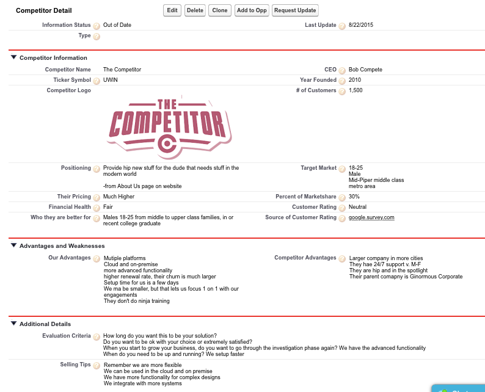

<!-- Radio Active icon by Icons8 -->
 

# Competitors App

## Overview
Has been replaced by the <a href="https://github.com/meighan/competitors-with-account">Competitors on Account</a>. This app should be used if wanting to track competitors on a custom object vs account.pp to hold competititive intelligence in Salesforce for sales enablement.  Also gives better reporting than the horror that is multiselect picklists for Competitors on Opportunities.  You can see who you compete against, when you win, and when you lose, and why, so you can determine if it is a feature, poor sales content, or a training issue.

### Details
Includes 2 Custom Objects, "Competitors" to hold Competitor data, and "Opportunity Competitors", a junction object between Competitors and Opportunities with custom insight from the sales team about being head to head with the competitor in that deal.  2 visualforce pages are on the Opportunity Competitor record, to show the Competitor corporate details without having the click to the competitor.

### After install
Once installed the id for the Email Templates (update and new Competitor) need to be added to the button urls.
The update interval for records is set at 90 days basedon the "Last Update" date.  Make sure to adjust the workflow rule if changing the requirements AND the Status formula field.
Help text is provided for the Competitor and Opportunity Competitor fields

<a href="https://icons8.com">Icon pack by Icons8</a>
